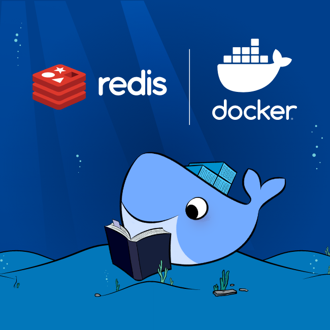

# Despliegue Automatizado de Base de Datos Redis con Docker

Este repositorio tiene como objetivo automatizar el despliegue de una base de datos Redis en un contenedor de Docker, proporcionando una solución de caché para una aplicación de red.
  
## Desplegando con DOCKER COMPOSE

1. **Clonación del Repositorio:**
    ```bash
        git clone https://github.com/luis122448/smart-shell-redis.git
    ```

2. **Modificación del Archivo de Configuración:**
    ```bash
        cd smart-shell-redis
        nano docker-compose.yml
    ```
    Modificar la contraseña y la memoria máxima de la base de datos Redis.
    ```yml
        ommand: redis-server --requirepass <password> --maxmemory 1gb --maxmemory-policy volatile-lru
    ```

3. **Creación de la Red:**
    ```bash
        docker network create smart-shell-net
    ```

4. **Despliegue de la Base de Datos:**
    ```bash
        cd smart-shell-redis
        docker-compose up -d
    ```

## Verificacion del despliegue

1. **Conexion al CONTENEDOR**
    ```bash
        docker exec -it redis-smart-shell bash
    ```

2. **Conexión a la BASE DE DATOS de Redis**
    ```bash
        redis-cli
    ```

3. **Auhenticando**
    ```bash
        AUTH <password>
    ```

4. **Verificando conexion**
    ```bash
        ping
    ```

5. **Informacion del servidor**
    ```bash
        INFO
    ```

## Cadena de Conexion
 Configuracion para un proyecto de JAVA con SPRING BOOT (application.properties):
    ```properties
        # Configuración de Redis
        spring.redis.host=${REDIS_HOST:localhost}
        spring.redis.port=${REDIS_PORT:6379}
        spring.redis.password=${REDIS_PASSWORD:mysecurepassword}
    ```

## Contribuciones
Las contribuciones son bienvenidas. Siéntete libre de mejorar este proyecto, agregar nuevas características o corregir problemas identificados. Para contribuir, crea un Pull Request o abre un Issue.

## Licencia
Este proyecto está bajo la licencia MIT License.